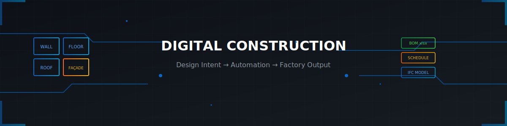

<div align="center">



<br/>

# A. Sam Mohammad


<br/>

<a href="https://www.linkedin.com/in/samamohammad-92790416b">
  
</a>

<a href="https://github.com/Sammohammad78">
  
</a>

</div>


---

## About

Product engineer in the Netherlands working on industrialised housing and prefab systems.

I build automation that turns Revit from a drawing application into a production system where joins behave, views stay consistent, and configurations follow rules instead of tribal knowledge.

<table>
<tr>
<td>

**Experience**
</td>
<td>

15+ years in construction + façade engineering
</td>
</tr>
<tr>
<td>

**Approach**
</td>
<td>

Lean Six Sigma — if it can't be measured and repeated, it doesn't ship
</td>
</tr>
<tr>
<td>

**Languages**
</td>
<td>

🇬🇧 English · 🇳🇱 Nederlands · 🇹🇷 Türkçe · 🇸🇦 العربية
</td>
</tr>
</table>

---

## 🧱 What I Build

<table>
<tr>
<td width="50%" valign="top">

###  Prefab Housing Systems

Rule-based component logic for walls, floors, roofs, façades.  
Variant handling inside a controlled product set.  
QA gates before production handoff.

</td>
<td width="50%" valign="top">

###  Revit Automation

Section placement + consistency enforcement.  
Dimensioning rules across views.  
Join / seam logic for module connections.

</td>
</tr>
<tr>
<td width="50%" valign="top">

###  Façade Systems

Constraint-driven panel grids + sub-frames.  
Geometry + schedules + BOM exports aligned.  
Optioning without full rework.

</td>
<td width="50%" valign="top">

###  BIM → Data Pipelines

Structured exports for downstream systems.  
QA reporting + dashboards via Power BI.  
Coordination workflows via ACC / BIM 360.

</td>
</tr>
</table>

---

## 🔧 Stacks


<br/>

<table>
<tr>
<td width="50%" valign="top">

###  BIM Production


**Typical output:** production-ready, validated models cleared for detailing handoff.

</td>
<td width="50%" valign="top">

###  Revit Rule-Automation


**Typical output:** enforce standards, automate repeatable tasks, cut manual correction cycles.

</td>
</tr>
<tr>
<td width="50%" valign="top">

###  Revit Add-ins (Software Lane)


**Typical output:** compiled tools with UI — validation panels, batch processors, commands teams actually use.

</td>
<td width="50%" valign="top">

###  Platform + Web Automation


**Typical output:** services that move BIM data between Revit, cloud, and external systems.

</td>
</tr>
<tr>
<td width="50%" valign="top">

###  BIM → Reporting


**Typical output:** dashboards that surface model health, quantities, and QA metrics.

</td>
<td width="50%" valign="top">

###  Workflow Orchestration


**Typical output:** automated pipelines that validate, notify, and move data without manual chasing.

</td>
</tr>
<tr>
<td colspan="2" valign="top">

###  Engineering Quality


**Typical output:** versioned automation with checks — so the code is as reliable as the output it produces.

</td>
</tr>
</table>

---

## 🛠️ Workflow

<div align="center">



</div>

---

## 🧭 Operating Principles

```text
The point is not clever automation. The point is boring consistency.

→ Clear rules instead of personal habits
→ Fewer manual edits, fewer surprises in deliverables
→ Downstream teams can trust the model without reverse-engineering intent
→ If it can't be measured and repeated, it doesn't ship
```

---

## 🔮 Now Building

<table>
<tr>
<td>🌐</td>
<td>Deeper APS integrations for cloud-based model data extraction</td>
</tr>
<tr>
<td>🧱</td>
<td>C# add-ins with proper UI for validation workflows</td>
</tr>
<tr>
<td>🧪</td>
<td>CI pipelines for Dynamo graphs (version control + automated testing)</td>
</tr>
</table>

---

<div align="center">

**Interested in prefab systems, BIM automation, or industrialised construction?**

<br/>

<a href="https://www.linkedin.com/in/samamohammad-92790416b">
  
</a>

<br/><br/>

<sub>🏗️ Built with Revit · Automated with Dynamo · Documented with Markdown</sub>

</div>
