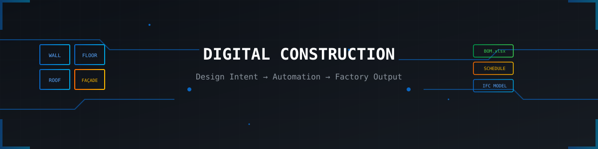

 

# A. Sam Mohammad

### Product Engineer · BIM & AEC Automation

I connect engineering knowledge, BIM workflows, and software to make construction processes more repeatable.

 

---

## About Me

I am a Product Engineer based in the Netherlands, with more than 15 years of experience across construction and façade engineering.

My work sits between **engineering, BIM, and software development**. I use tools such as Revit, Dynamo, Python, Rhino, and Grasshopper to turn repetitive engineering work into structured and reusable workflows.

I am especially interested in problems where technical knowledge is still stored in personal habits, manual checks, spreadsheets, or undocumented modelling steps.
---

## What I Work On

### Revit and BIM Automation

* Automating repetitive Revit modelling and documentation tasks
* Translating engineering standards into clear digital rules
* Improving consistency across views, elements, and project configurations
* Creating validation and quality-control workflows

### Parametric Construction Systems

* Rule-based façade, wall, roof, and opening configurations
* Rhino.Inside.Revit and Grasshopper workflows
* Controlled generation of design and production variants
* Connecting parametric geometry with native Revit elements

### AEC Software and Data

* Python tools for BIM and engineering workflows
* Revit API experiments and C# add-in development
* Structured BIM-data exports and reporting
* Connecting models with web applications, APIs, and AI tools

---

## Selected Work

### [AEC Model Bridge](https://github.com/Sam-AEC/aec-model-bridge)

An open-source connection layer between AI assistants and live Revit environments.

The project explores how engineers can safely query models, create and modify elements, run quality checks, and automate documented Revit workflows through an MCP server and Revit add-in.

**Focus:** Revit API · Python · C# · MCP · Engineering automation

---

### [FacadeIQ — Beta](https://facadedata.vercel.app/)

A free web platform that automates several early-stage façade engineering calculations and environmental checks.

It is designed to help façade engineers, architects, and developers get a faster first technical overview before moving into detailed engineering.

**Focus:** Façade engineering · Calculation automation · Web tools · Technical reporting

---

## Core Toolkit

### Tools I Use Regularly

### Areas I Am Developing Further

---

## Let’s Connect

I enjoy connecting with people working on:

* BIM and Revit automation
* Parametric and industrialised construction
* Façade engineering technology
* AEC software and product development
* Practical applications of AI in engineering

I am also open to selected collaborations involving Revit tooling, BIM workflow automation, façade systems, and AEC product development.

 

  

Engineering experience translated into repeatable digital workflows.

