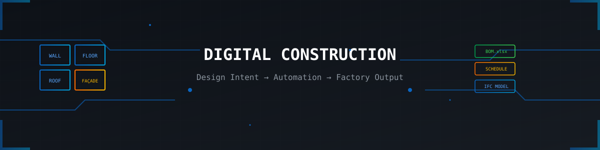

# A. Sam Mohammad

### Product Engineer · BIM & AEC Automation

I turn construction and façade engineering knowledge into reusable BIM workflows, parametric systems, and software tools.

**Based in the Netherlands · 15+ years in construction and façade engineering**

[Explore my work](#selected-work) · [BIM workflows](#engineering-workflows) · [Tech stack](#tech-stack) · [Connect on LinkedIn](https://www.linkedin.com/in/a-sam-mohammad-92790416b)

## Selected work

### [AEC Model Bridge — Revit MCP server](https://github.com/Sam-AEC/aec-model-bridge)

Connect Claude, Codex, and other MCP clients to a live Revit model through a Python server and a native C# add-in. Read model data, inspect warnings, work with parameters, and prepare documentation workflows. **In the default mode, model changes require a plan that you review and approve.**

For BIM engineers and developers exploring practical AI-assisted model workflows. The project also includes IFC reading and providers for Rhino, Grasshopper, and Speckle; see the repository for integration status and prerequisites.

**[View source](https://github.com/Sam-AEC/aec-model-bridge) · [Installation guide](https://github.com/Sam-AEC/aec-model-bridge/blob/main/docs/install.md) · [MCP tool reference](https://github.com/Sam-AEC/aec-model-bridge/blob/main/docs/tools-generated.md) · [Security and approval](https://github.com/Sam-AEC/aec-model-bridge/blob/main/docs/security.md)**

### [FacadeIQ — Beta](https://facadedata.vercel.app/)

A free web platform for early-stage façade engineering calculations and environmental checks. It helps façade engineers, architects, and developers get an initial technical overview before detailed engineering.

**Focus:** Façade engineering · Calculation automation · Web tools · Technical reporting

**[Explore FacadeIQ](https://facadedata.vercel.app/)**

## Engineering workflows

My work connects model information with the calculations, checks, and outputs engineering teams need:

- **BIM automation:** Revit tools, parameter workflows, views, sheets, and structured model-data exports.
- **Parametric construction:** Reusable geometry and workflows for façade systems and industrialised construction.
- **Engineering data and software:** Python tools, C# add-ins, reporting, and connections between models, APIs, web applications, and AI clients.

## Tech stack

| Area | Tools and technologies |
| --- | --- |
| BIM and computational design | Revit · Dynamo · Rhino · Grasshopper |
| Software and automation | Python · C# · .NET · Revit API · TypeScript |
| Model data and integration | IFC · MCP · REST APIs · Autodesk Platform Services |
| Collaboration and delivery | Autodesk Construction Cloud · Git · GitHub · CI/CD |

## About me

I work at the intersection of **engineering, BIM, and software development**. My background in construction and façade engineering shapes how I build tools: around practical engineering tasks, repeatable processes, and useful model data.

## Let's connect

I am open to selected collaborations involving **Revit tooling, BIM workflow automation, façade systems, and AEC product development**.

If you are working on an engineering workflow that could benefit from automation, connect with me on LinkedIn.

