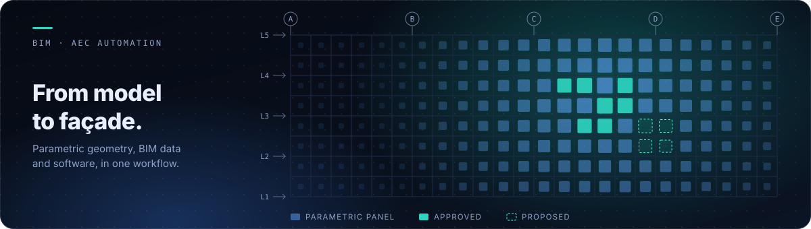
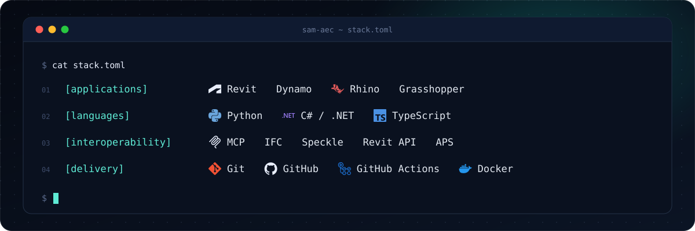

# A. Sam Mohammad

**Product Engineer · BIM & AEC automation**

I build software that makes construction engineering repeatable: tools that connect BIM models, parametric geometry and AI assistants. 
15+ years in construction and façade engineering · Netherlands

[**AEC Model Bridge**](https://github.com/Sam-AEC/aec-model-bridge) · [**FacadeIQ (beta)**](https://facadedata.vercel.app/) · [**LinkedIn**](https://www.linkedin.com/in/a-sam-mohammad-92790416b)

---

## Selected work

### [AEC Model Bridge](https://github.com/Sam-AEC/aec-model-bridge)

**AI assistants propose. You approve. Revit changes.**

An open-source MCP server and native Revit add-in that lets assistants such as Claude and Codex read and edit the Revit model you have open. Any tool that changes the model goes through a plan that you review and approve first.

| At a glance | AEC Model Bridge |
| --- | --- |
| **What it enables** | Reading models, editing parameters, creating elements, sheets and views, QA/QC checks and exports from an AI assistant, plus IFC reading without Revit |
| **Who it helps** | BIM managers, computational designers and engineers who want to automate documentation and QA work without giving an AI unchecked write access |
| **Maturity** | Released (v1.3.3) with CI. Revit and IFC are available; Navisworks is in progress. Needs Windows and a licensed Revit for live use |
| **Try it** | Start in mock mode without Revit, or download a [release](https://github.com/Sam-AEC/aec-model-bridge/releases/latest) with an add-in per Revit year |
| **Inspect it** | [Source](https://github.com/Sam-AEC/aec-model-bridge) · [Install guide](https://github.com/Sam-AEC/aec-model-bridge/blob/main/docs/install.md) · [Security](https://github.com/Sam-AEC/aec-model-bridge/blob/main/docs/security.md) · [Tool catalogue](https://github.com/Sam-AEC/aec-model-bridge/blob/main/docs/tools-generated.md) |

  <picture>
    <source media="(prefers-color-scheme: dark)" srcset="https://raw.githubusercontent.com/Sam-AEC/aec-model-bridge/main/docs/images/approval-flow-dark.png">
    
  </picture>

### [FacadeIQ](https://facadedata.vercel.app/) (beta)

A free web platform that automates several early-stage façade engineering calculations and environmental checks. It gives façade engineers, architects and developers a faster first technical overview before detailed engineering starts.

**Maturity:** beta. **Try it:** [facadedata.vercel.app](https://facadedata.vercel.app/).

---

## Background

I'm a product engineer with more than 15 years in construction and façade engineering. My work sits between engineering, BIM and software development. I use Revit, Dynamo, Python, Rhino and Grasshopper to turn repetitive engineering work into structured, reusable workflows.

## Stack

| Area | What I use it for |
| --- | --- |
| BIM and computational design | Revit and Dynamo for models and automation, Rhino and Grasshopper for parametric geometry |
| Software and automation | Python for tools and the MCP server, C# and .NET for the Revit add-in, and TypeScript |
| Model interoperability | MCP for AI access, IFC and Speckle for model data, Revit API and Autodesk Platform Services for Autodesk platforms |
| Delivery | Git, GitHub Actions for CI and releases, Docker for reproducible runs |

---

## Work with me

I'm open to selected collaborations on:

- Revit tooling and BIM workflow automation
- Façade systems and parametric or industrialised construction
- AEC product development
- Practical applications of AI in engineering

The quickest route is [LinkedIn](https://www.linkedin.com/in/a-sam-mohammad-92790416b). A short note on the workflow you want to improve is a good start.
